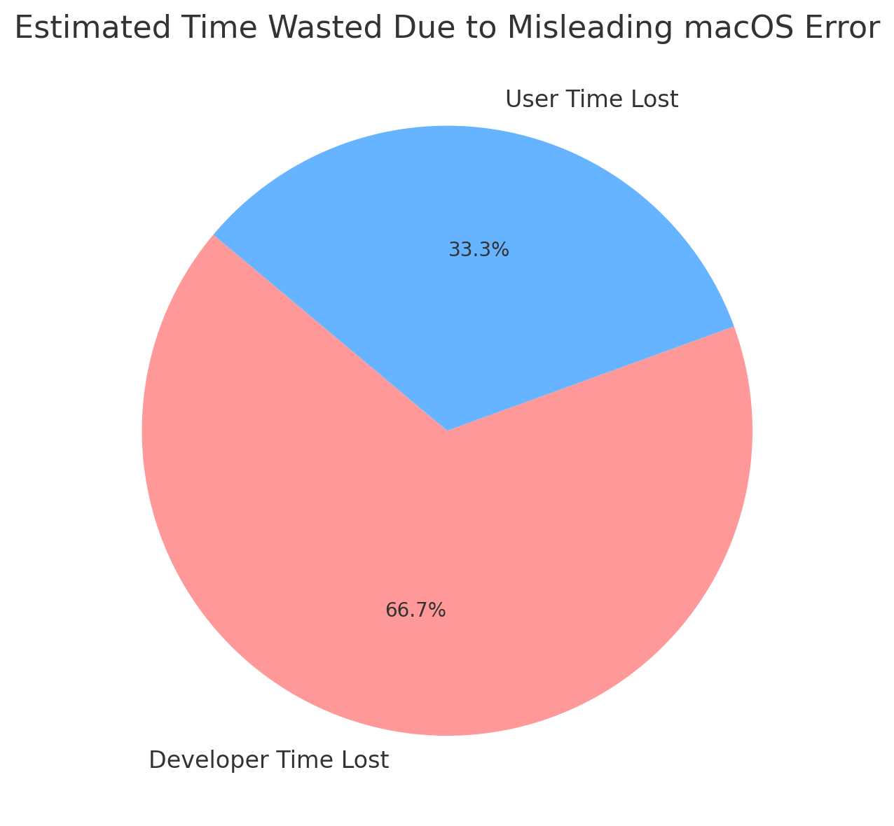

# ❌ Misleading macOS “App is Damaged” Warning

If this project helped you, please consider giving it a ⭐ on GitHub!
[](https://github.com/milisp/misleading-macos-damaged-warning/stargazers)

macOS users often encounter this misleading message:

> “App is damaged and should be moved to the Trash.”

In reality, the app is **usually not damaged at all** — it simply lacks Apple notarization or signature.

---

## 💥 Why This Warning Is Misleading

- The word “damaged” implies corruption or malware, but most of the time the app is just unsigned.
- Users are misled into deleting perfectly safe software.
- Apple could use a more accurate term like “Unverified” or “Not Signed”.

---

## 📉 The Real-World Cost

Conservative estimates show:

- 🧑‍💻 100,000 developers affected
- 📉 Over 1 million users abandoned apps due to this warning
- 🕒 Developers waste ~2 hours each explaining and repackaging
- 💵 Estimated productivity loss: $15,000,000+

> 

---

## 🧪 Real-World Cases

See More than 50 [CASES.md](./CASES.md) for community-submitted stories, or view a few highlights below:

### 📁 CASE: All Files Marked as Damaged After macOS Monterey Update  
[Apple Forum](https://discussions.apple.com/thread/253714860)

> “All my Word, Excel, and PDF files suddenly show 'is damaged' after updating macOS.”

### 💻 CASE: Third-Party Apps Blocked on macOS Ventura  
[Reddit](https://www.reddit.com/r/macsysadmin/comments/13vu7f3/app_is_damaged_and_cant_be_opened_error_on_ventura/)

> “Gatekeeper disabled, but Ventura still reports app is 'damaged'. Misleading and unhelpful.”

---

## 🛠️ How to Bypass This Warning

If you trust the app, bypass it with:

```bash
xattr -rd com.apple.quarantine /path/to/your.app
```

Or use “Right-click → Open” in Finder.

🎥 [Watch: How to Fix “App is damaged and can’t be opened” on macOS (YouTube)](https://www.youtube.com/watch?v=MEHFd0PCQh4)

---

## 🤝 What We Want

- 📢 Apple should revise this message to something accurate, like “App is not signed.”
- 🧑‍💻 Developers deserve clarity and trust
- 🛡️ Users deserve confidence when using safe apps

---

## 📬 Get Involved

- ✍️ Submit your story → [CASES.md](./CASES.md)
- 🐛 File an Issue
- ⭐ Star this repo to show support
- 🔁 Share with your community

[](https://github.com/milisp/misleading-macos-damaged-warning/stargazers)