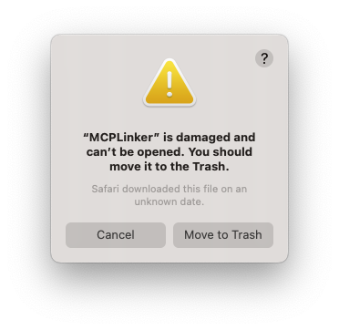

# macOS“应用已损坏”误导性提示 ❌

[](https://github.com/milisp/misleading-macos-damaged-warning/stargazers)

许多 macOS 用户会遇到如下提示：



> “应用已损坏，建议将其移到废纸篓。”

但事实上，**应用本身通常运行良好**，这个提示出现的原因往往只是因为应用**没有经过 Apple 的签名或公证（Notarization）**。

本项目收集了以下内容：
- 💥 用户或开发者受到影响的真实案例
- 🔧 安全运行此类应用的方法
- ✊ 呼吁 Apple 改变这种误导性措辞

> 📖 [English Version / 英文原文在此](./README.md)

---

## 🔥 为什么这个提示具有误导性

Apple 的提示写的是“应用已损坏”，但这在大多数情况下完全不是事实。  
通常只是因为应用未签名或未经过 Apple 的公证机制。  
并没有文件损坏、恶意软件或功能故障 —— 只是缺少 Apple 的认证标记。  
但这个提示却暗示应用有问题或不安全，吓退了很多用户。

---

## 📦 真实案例

### 🧑‍💻 案例 1：XYZ 应用提示“已损坏，无法打开”

[Apple 官方论坛原帖](https://discussions.apple.com/thread/253714860)

> 我今晚突然开始收到这个错误提示：“XYZ 应用已损坏，无法打开，建议将其移到废纸篓。”  
> 我今天早上刚刚更新了 Monterey 系统。我的文件（Word、Excel、PDF 等）在一小时前还一切正常，现在全部提示损坏。  
> 有没有什么解决办法？

### 案例 2：Ventura 系统下出现“应用已损坏无法打开”错误

[Reddit 原贴](https://www.reddit.com/r/macsysadmin/comments/13vu7f3/app_is_damaged_and_cant_be_opened_error_on_ventura/)

> 升级 Ventura 后，一些第三方应用出现“应用已损坏无法打开，此文件下载于未知日期”的错误。  
> 即使禁用 Gatekeeper 也无法解决。

---

## 💥 对用户和开发者的实际伤害

这句提示虽然只有一行字，但造成了真实伤害：
- 💔 用户以为是病毒，删除了安全无害的应用
- 🧑‍💻 开发者失去测试者、用户和声誉
- 🕐 无数时间被浪费在解释、调试和安抚用户上

---

## 🧪 更多真实案例

请参阅 [CASES.md](./CASES.md)，其中收录了更多开发者和用户的投稿案例。

---

## 🧰 如何绕过这个提示

如果你信任应用的来源，可以使用以下命令绕过提示：

```sh
xattr -rd com.apple.quarantine /路径/你的应用.app
```

你也可以尝试用 Finder 右键 → 打开，有时也能成功。

🎥 [观看视频：如何修复 macOS“应用已损坏无法打开”错误（YouTube）](https://www.youtube.com/watch?v=MEHFd0PCQh4)

---

## 🤝 欢迎加入我们

如果你也曾被这个错误提示困扰或误导：
- 📩 请在 [CASES.md](./CASES.md) 中提交你的经历
- 🐛 提交 [Issue](https://github.com/milisp/misleading-macos-damaged-warning/issues) 描述你遇到的问题
- ⭐ 给本项目 [点个 Star](https://github.com/milisp/misleading-macos-damaged-warning)
- 🔁 在社交媒体分享这个 repo
- 🧾 联名支持 Apple 改进这个提示语

[](https://github.com/milisp/misleading-macos-damaged-warning/stargazers)